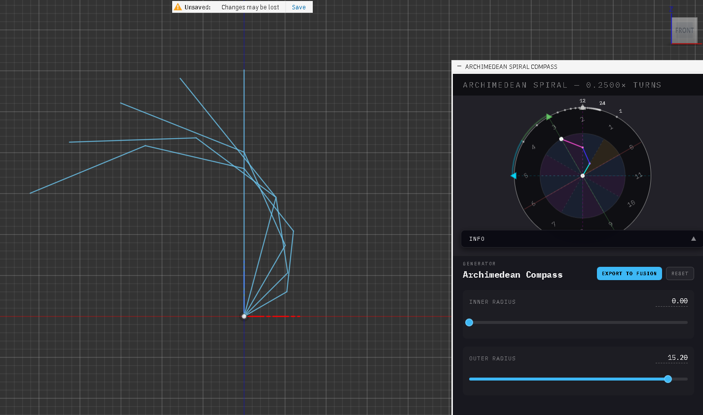

# Archimedean Spiral Compass

A **Vibe-coded** tool for generating and visualizing Archimedean spirals. Designed as a standalone web application and a seamless add-in integration for **Autodesk Fusion 360**.

**Completely programmed by AI - Original idea and work in process by me** - I actually have no idea what i'm doing, I just needed a tool for very weird loft function where I just haven't completely decided on the final shape yet.

- This is not a mathematically correct tool.
- Feel free to use, edit and share as you like.

---

## 🚀 Overview
The Archimedean Spiral Compass allows users to parametrically define spirals by adjusting radii and segment counts. It provides real-time visualization and exports the geometry as a DXF (Drawing Exchange Format) file. When used within Fusion 360, it provides a "One-Click Import" experience to turn your mathematical spirals into editable sketches.

## ✨ Key Features
* **Parametric Control**: Adjust start/end radii, radial segments (spiral turns), and rotational segments (resolution).
* **Live Preview**: Real-time 2D canvas visualization with measurement overlays.
* **Fusion 360 Integration**: Dedicated Python add-in to bridge the web UI directly into the CAD environment.
* **Smart DXF Generation**: Creates clean, polyline-based DXF strings for high compatibility.
* **Responsive UI**: Dark-mode optimized, mobile-friendly interface with IBM Plex Mono typography.

## 📂 File Structure
├── index.html              # Main entry point (loads UI and logic)
├── styles.css              # Modern, dark-themed responsive layout
├── compass.js              # Core math, state management, and Canvas rendering
├── fusion360.js            # JavaScript bridge for Fusion 360 communication
└── SpiralCompassAddin.py   # Python Add-in for Fusion 360 integration

## 🛠 Installation (Fusion 360)
1. **Locate Add-ins Folder**: Open Fusion 360, go to Utilities > Add-ins > Scripts and Add-ins.
2. **Create New Add-in**: Click "Create", select Python, and name it SpiralCompass.
3. **Copy Files**:
    * Replace the default .py file with SpiralCompassAddin.py.
    * Place index.html, styles.css, compass.js, and fusion360.js in the same folder as the .py script.
4. **Run**: Select SpiralCompass from the list and click Run. A new "Spiral Compass" icon will appear in your Solid > Scripts and Add-ins panel.

## 📖 Usage

### Parameters
* **Inner Radius (mm)**: The starting distance from the center.
* **Outer Radius (mm)**: The maximum extent of the spiral.
* **Radial Segments**: Controls the number of full rotations (e.g., 2.0 = two full turns).
* **Rotational Segments**: Defines the smoothness of the curve (higher = smoother). (Currently broken, only 12 segments work at the moment)

### Direct Import
Click **"Import into Fusion 360"**. The add-in will prompt you to select a plane or planar face in your active design. Once selected, the spiral is automatically generated as a sketch.

## ⚠️ Known Issues & Planned Updates

### Current Limitations
* **Mathematical Calibration**: Currently, all rotational segments other than 12 are not mathematically calibrated.
* **UX / Window Placement**: In Fusion 360, the initial window placement of the addin WebUI is currently not programmed according to UX.
* **Sketch Placement**: Currently placement of sketch geometry is only working with plane construction surfaces. It has only been tested on XY, XZ and YZ planes.

### Future Roadmap
* **Enhanced Geometry Support**: Plans are underway to expand sketch placement functionality to include non-standard construction planes and arbitrary planar faces.
* **Dynamic Calibration**: Implementing a more robust mathematical engine to support arbitrary rotational segment counts without loss of precision.
* **UI Refinement**: Programmatic window centering and sizing within the Fusion 360 viewport for a more seamless integration.

## ⚙️ Technical Notes
* **Shared Scope**: compass.js manages the global appState. fusion360.js depends on this state for DXF generation.
* **The Bridge**: Communication between the UI (JavaScript) and Fusion 360 (Python) is handled via adsk.fusionSendData.
* **Canvas Scaling**: The visualization utilizes window.devicePixelRatio for high-resolution rendering on Retina and 4K displays.

---
*Developed for parametric design and mathematical exploration*
